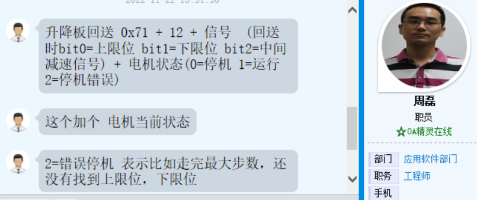

### 需求怎加项 

~~~ 
	1、按现有黄钢程序，机头升降功能正常，上升速度200，下降速度300，圣东尼反应比之前的慢点，但是也可以接受。
	2、需要有保护功能，上/下限位传感器损坏要有保护功能，升降电机不能一直转,圣东尼进口机器是这样实现的：
	 整个升降行程是100个脉冲，限位点是95个脉冲，那么在发送98个脉冲后，还没有检测到限位，就停止运行报警，
	 所以即使限位丢失，也能很及时的保护。
	3、中间停止功能，要一直触发（停机+升/降）按钮，升降电机才会运行，一旦释放按钮，电机就要停止运行，再次按键，电机再次运行。
	4、剪线下降功能，机头正常停在下限位，收到制版指令后，还要再下降一段距离，正常是1.25mm，电机运行1/4圈。
~~~

### 机械参数
~~~JSON
电机转一圈 200个脉冲（黄冈代码基础上）
电机丝杆螺距：5mm  
丝杆最大行程：约125mm
最大位置默认设置：125/5x200=5000
~~~

### 周磊输出最新需求及交互协议V0.0
~~~json
==========走位置设置
临时停机    0xd4 +0x01 +0x00
到上限位    0xd4 + 0x01 + 0x01 
到下限位    0xd4 + 0x01 + 0x02
走上下位过程中，没到位置，回原来位置  0xd4 + 0x01 +0x03
走上下位过程中，没到位置，继续走当前位置  0xd4 +0x01 +0x04

走偏移位置：走当前位置的偏移位置
往上走偏移位置 0xd4 +0x02 +0x01 + 偏移位置高0x00 + 偏移位置低0x00
往下走偏移位置 0xd4 +0x02 +0x02 + 偏移位置高0x00 + 偏移位置低0x00
===========信号和原来一样
主控发 0x71 + 0x0c ,升降板收到后先上报一次，后面有信号变化主动上报
升降板回送0x71 + 0x0c + 0x00+信号  (回送时bit0=上限位 bit1=下限位 bit2=中间减速信号)

===========参数设置
方向设置  往上走的方向 
0xd4 + 0x10 + 方向

电机使能 (默认上电使能)
0xd4 + 0x11 + 使能0x00

速度设置  运行速度，减速信号速度
0xd4 + 0x12 + 运行上升速度高0x00 + 运行上升速度低0x00 
0xd4 + 0x13 + 运行下降速度高0x00 + 运行上升速度低0x00 
0xd4 + 0x14 + 减速速度高0x00 + 减速速度低0x00

电流设置  运行电流 锁定电流
0xd4 + 0x15 + 运行电流高0x00 + 运行电流低0x00 
0xd4 + 0x16 + 锁定电流高0x00 + 锁定电流低0x00(根据总电流分(Max)1-15(Min)挡，默认锁定电流是总电流的1/4)

最大位置设置
0xd4 + 0x17 + 最大位置高0x00 + 最大位置低0x00 
~~~  
### 周磊协议修改 信号返回 2022/11/22

### 明确减速点   2022/11/24  
~~~JSON
传感器接入TCM5160电机芯片 "未在MCU管脚"
依靠SPI读电机芯片
减速点仅下降有效
~~~

### 修改上报信号  2022/12/ 2
~~~JSON
新的 上报格式 0x71 0c +电机+传感器
~~~
### 查找报警后触发减速点电机依然转动  2022/12/ 9
~~~JSON
反复测试 现象不在出现
	判断电机在走 上下位过程中，没到位置回原位置模式下，误判BUG
~~~
